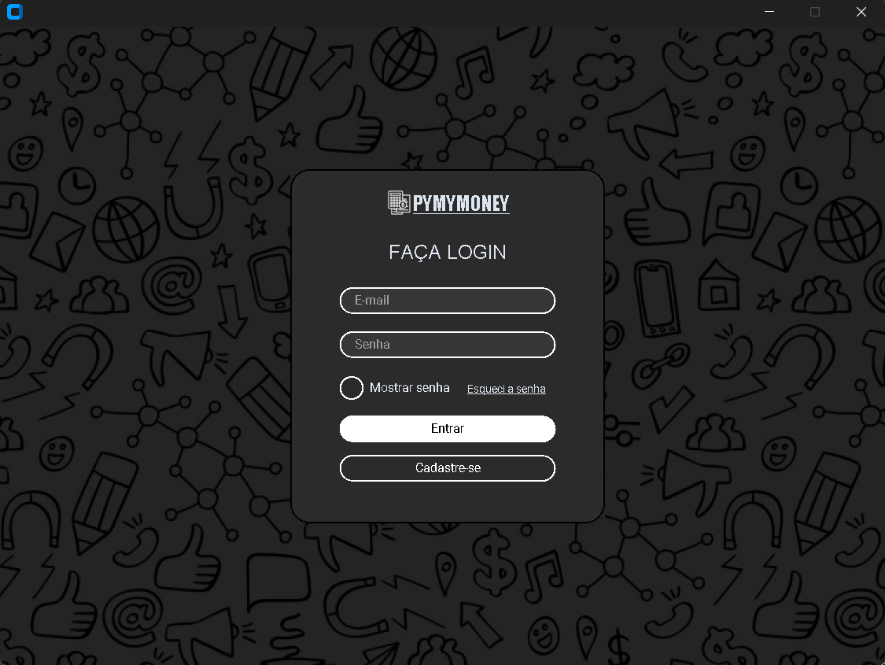
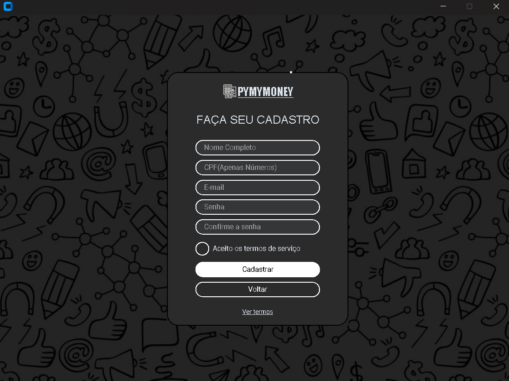
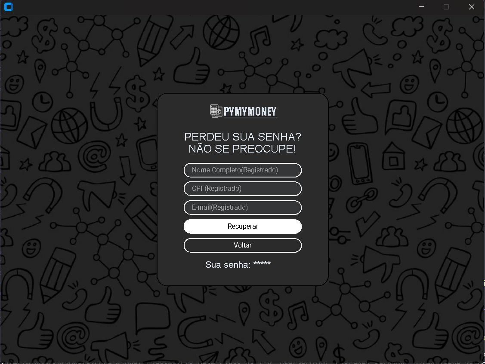
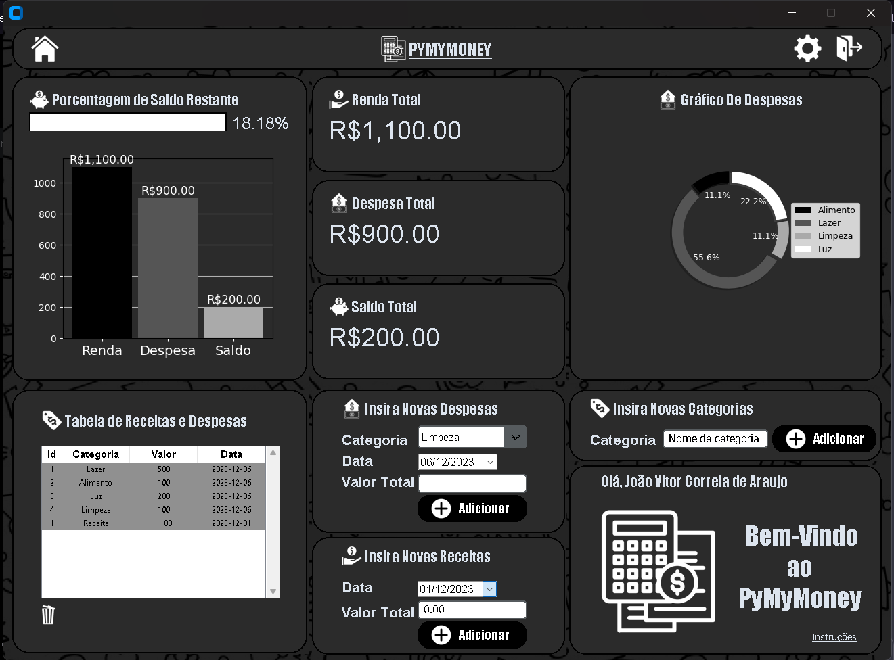
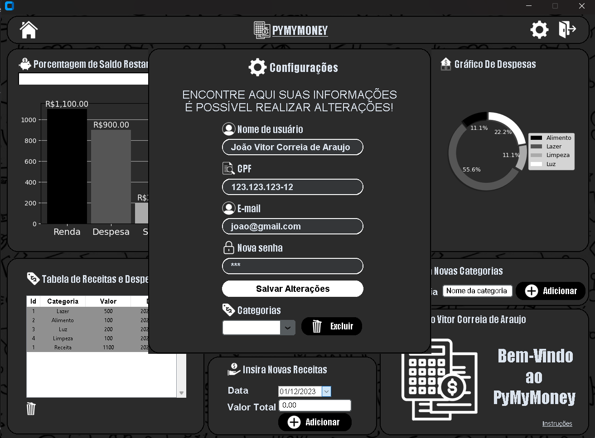

<h1 align="center">PyMyMoney</h1>
<h3 align="center">Construindo o PyMyMoney, um aplicativo de despesas pessoais feito com python e SQLite!</h3>

##

<h2 align="center"> Requirements </h2>

```
pip install -r requirements.txt
```

</div>

<p align="center"> 
    
<br>

<h2 align="center"> Aparência </h2>

<div align="center">
  
  
  
  
  
  
  

</div>


- Tela interativa
- Realize Login
- Cadastre Usuários
- Atualize sua conta conforme necessário

<h2 align="center"> Aplicativo em execução </h2>
[Assista ao vídeo](https://www.youtube.com/watch?v=o5IKUkNy9Fk)


<h2 align="center"> Estrutura do main.py </h2>

```python
class MyApp(ctk.CTk):
    def __init__(self):
        super().__init__()
        self.window = self 
        self.window .title("")
        self.window .geometry("900x650")
        self.window.resizable(False, False)
        ctk.set_appearance_mode("dark")

        
        self.images = {} # Dicionário para armazenar as imagens

        self.load_images()
        self.login_screen()

def load_images(self):... # Restante da lógica

def login_screen(self):... # Restante da lógica

def main_screen(self):... # Restante da lógica

if __name__ == "__main__":
    app = MyApp()
    app.mainloop()
```
